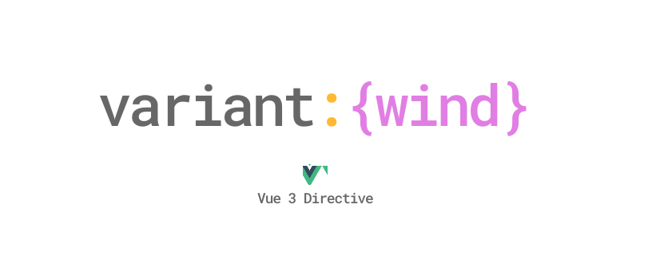

<p align='center'>

</p>
<h1 align='center'>
<samp>variantwind</samp>
</h1>
<p align='center'>
<strong>Most elegant</strong> way to work with <strong>TailwindCSS</strong> variants in Vue 3
</p>

<p align='center'>
Use as <em>directive</em> or <em>binding</em>, also supports <strong>PurgeCSS</strong> 🔥🔥
</p>

## Installation

```sh
yarn add variantwind
```

## Usage

### Directive

```js
import { createApp } from "vue";
import App from "./App.vue";
import { directive } from "variantwind";

const app = createApp(App);

app.directive("variantwind", directive);

app.mount("#app");
```

Or register as a Plugin

```js
import { createApp } from "vue";
import App from "./App.vue";
import Variantwind from "variantwind";

const app = createApp(App);

// Second argument is directive name (optional) default: "variantwind"
app.use(Variantwind, "variantwind");

app.mount("#app");
```

```html
<template>
  <div
    class="w-full bg-red-500 md:{w-1/3 bg-blue-500} lg:{w-1/4 bg-yellow-500 hover:bg-yellow-900}"
    v-variantwind
  >
    Hello world
  </div>
</template>
```

### Binding

```html
<template>
  <div
    :class="variantwind('w-full bg-red-500 md:{w-1/3 bg-blue-500} lg:{w-1/4 bg-yellow-500 hover:bg-yellow-900}')"
  >
    Hello world
  </div>
</template>

<script>
  import { variantwind } from "variantwind";

  export default {
    methods: { variantwind },
  };
</script>
```

## Tailwind Purge Setup

```js
// tailwind.config.js
const { extractor } = require("variantwind");

module.exports = {
  purge: {
    content: [
      "./index.html", 
      "./src/**/*.vue", 
      "./src/**/*.js"
    ],
    extractors: [
      { 
        extractor, 
        extensions: ["vue"] 
      }
    ],
  },
};
```

### License

[MIT License](https://github.com/sibbngheid/variantwind/blob/master/LICENSE) © 2020 [Sibbngheid](https://github.com/sibbngheid)
